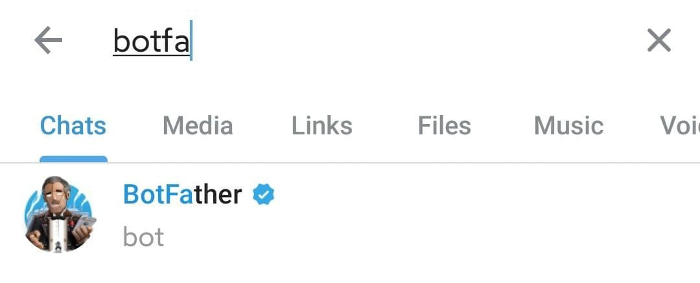

<!--
 * @Author: zym
 * @Date: 2021-12-09 10:59:35
 * @LastEditors: zym
 * @LastEditTime: 2021-12-09 12:22:48
 * @Description: 
 * @FilePath: \TgBotPush\README.md
-->
# Telegram Bot Push
一个可以轻松向Telegram Bot推送简单消息的shell

# 介绍
日常在执行一些定时任务时，会想看到执行结果，但又不想配置或者安装太复杂的软件。

而且平时使用Telegram的频率较高，所以想到了使用Telegram Bot来接收消息推送。

只需要配置几个简单的参数就可以轻松实现消息推送。

# 配置
只需要设置4个参数即可。

将这个tg_bot_push.sh复制或者创建到目标位置，然后修改里面的参数。

`TG_PROXY_HOST` = HTTP代理地址（当然，这个代理是可以访问Telegram服务器的）

`TG_PROXY_PORT` = HTTP代理端口

`TG_USER_ID` = 目标Telegram ID（一般是使用自己的机器人给自己推送，所以这里一般就填自己的id）

`TG_BOT_TOKEN` = Telegram Bot HTTP API

**以上参数不知道怎么获取的可以翻看下面有教程。**

# 使用
例如这个shell的位置是`/scripts/shell/tg_bot_push.sh`

那么执行命令就是：

`bash /scripts/shell/tg_bot_push.sh halo hhh hhhhh hhhhh `

然后打开Telegram就可以看到bot发来一条消息。

大功告成！

# 准备工作
## 准备Telegram Bot

直接搜索`BotFather`

然后发送`/start`

接着发送`/newbot`

然后就可以给bot命名了（需要注意的是，命名必须使用bot结尾）。

当返回`Done`时，即表示成功了，这时需要把`HTTP API`记录下来。

## 准备Telegram ID
搜索`userinfobot`并发送`/start`。

返回的信息里，把`id`记录下来。

## 准备HTTP代理

因为网络环境特殊，所以需要通过HTTP代理访问Telegram服务器。

HTTP代理一般的代理客户端都会有的，只需要打开本地代理（也就是服务端）即可，同时不要开启验证。

例如我是在软路由上使用的代理客户端，打开了本地代理：

# 命令详解

`--compressed`：curl自动解压缩响应页面（页面是压缩的话，例如目标服务器设置了gzip压缩了页面）。

`-k`：允许不使用证书到SSL站点

`-X `：请求方式GET/POST/DELETE等

`-L `：当页面需要重定向时，curl自动跟踪重定向响应

`-x `：指定HTTP代理

`-e `：目标地址

`-d `：POST请求时的参数